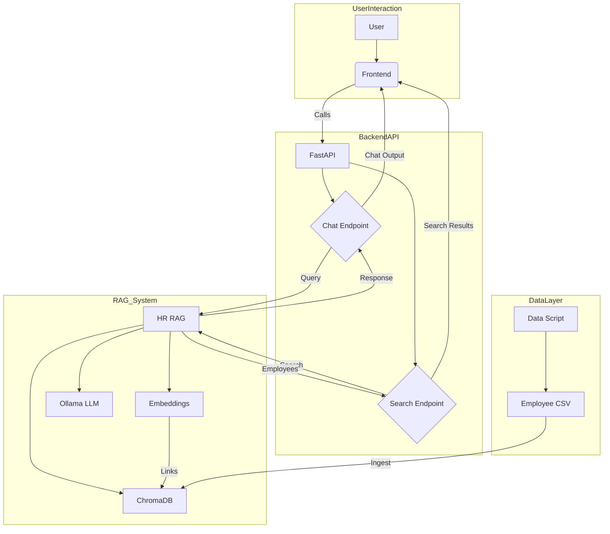

# HR Resource Query Chatbot

## Overview
### Description
The "HR Resource Query Chatbot" is a tool that has been built to be used by an organization's HR personnels to extract information related to any employee's skills, number of years of experience, past projects, and availability. An HR personnel may use this tool instead of manually accessing the organization's data base to find the talent for a requirement. The primary goal of this tool is to improve HR operational efficiency, such that an HR personnel may focus on more strategic initiatives.

### Aproach
To address the requirement the following steps were followed,
1. Initially a sample employee dataset was created with the following attributes,
    - `name`: Name of the employee.
    - `skills`: The different skills the employee has.
    - `experience_years`: Number of years of experience the employee has.
    - `past_projects`: The different project that the employee has worked on in the past.
    - `availability`: Availability status of the employee.
2. Thereafter, a Retrieval Augmented Generation (RAG) System was implemented using LangChain for the AI/ ML part.
3. Then a FastAPI backend was built to expose the HR Resource Query Chatbot's functionalities.
4. Finally, a single page HTML front-end was create with CSS styling.

## Features
The following is the list of implemented features,
1. Data Layer:
    - The script, `src/create_employee_data.py` creates a dataset of 100 employees. Each employee has the following attributes, `name`, `skills`, `experience_years`, `past_projects`, `availability`.
    - The generated employee data is saved in `data/employee_dataset.csv`.
2. AI/ ML Component (RAG System):
    - HuggingFace Embeddings: `sentence-transformers/all-MiniLM-L6-v2` has been used for generating embeddings of text data.
    - ChromaDB Integration:
        - Persistence: Stores and retrieves vector embeddings from a local `src/chroma_db_langchain` directory.
        - Collection Management: Uses a dedicated collection named `employee_profiles_langchain`.
        - Initialization Check: Warns if the ChromaDB is empty, indicating a need for data ingestion.
    - Ollama LLM Integration: Connects to a local Ollama instance using the `mistral` model for text generation. Includes a connection test during initialization.
    - LangChain RAG Pipeline:
        - Retrieval: Implements a retriever using ChromaDB, supporting `mmr` (Maximal Marginal Relevance) search to retrieve the top 5 relevant employee documents.
        - Document Formatting: A utility function (`_format_docs`) to convert retrieved LangChain `Document` objects into a readable string format for the LLM's context, including all key employee attributes.
        - Prompt Engineering: Defines a clear prompt template instructing the LLM to act as an HR assistant, use the provided context, and provide relevant employee names and attributes.
        - Chain Construction: Builds a complete RAG chain using LangChain Expression Language (LCEL) that integrates retrieval, context formatting, and LLM generation.
    - Asynchronous Operations: The `query_chatbot` and `search_employees_semantic` methods are `async`, suitable for non-blocking I/O in a web application.
3. Backend API (FastAPI):
    - RESTful API Endpoints:
        - `POST /chat`: To ask natural language queries to the RAG chatbot.
        - `GET /employees/search`: To conduct a direct search of employees based on keywords.
    - Pydantic Models for Data Validation:
        - `ChatQuery`: Validates incoming chat requests (ensuring query string).
        - `ChatResponse`: Defines the structure for chat responses.
        - `Employee`: Defines the structure for a single employee's data.
        - `EmployeeSearchResponse`: Defines the structure for employee search results (list of employees).
    - Error Handling: Implements `HTTPException` for various errors, including RAG system initialization issues and unexpected errors.
    - CORS Middleware: Configured to allow cross-origin requests from any source (`*`).
    - Static File Serving: Serves the frontend HTML and other static assets from the `/static` directory.
    - Root Route: Serves the `index.html` file at the application's root URL (`/`).
4. Frontend Interface (HTML, CSS, JavaScript):
    - Dual Panel Layout: The interface is a dual panel layout that separates Chat Assistant and Employee Search functionalities into distinct visual panels.
    - Asynchronous JavaScript (Fetch API): Communicates with the FastAPI backend using `fetch` for both chat and employee search.

## Architecture


## Setup & Installation
This app has been built, and has been tested on Python version: `3.9.6`.

### Cloning The Repository
- `git clone https://github.com/vidishsirdesai/hr_resource_query_chatbot.git`.

### Virtual Environment Setup
1. `cd <project_directory_path>`.
2. `pip install virtualenv`.
3. `python<version> -m venv <virtual_environment_name>` or `python3 -m venv .venv`.
4. A folder named "`.venv`" will appear in the project directory.
5. Activate the virtual environment using one of the commands listed below depending on the Operating System,
    - MacOS and Linux, `source .venv/bin/activate`.
    - Windows command prompt, `.venv/Scripts/activate.bat`.
6. Once the virtual environment is active, the environment name (in this case "`.venv`") will be visible in the parantheses before the prompt, like so "`(.venv)`".
7. To confirm if the virtual environment has successfully been create, run `pip list`. The following should be the output,
```
(.venv) vidish@Vidishs-MacBook-Air university_admission_predictor % pip list
Package    Version
---------- -------
pip        xx.x.x
setuptools xx.x.x
``` 
8. To deactivate the virtual environment, strictly run the following 2 commands in the same order,
    - `deactivate`.
    - `rm -r .venv`.

### Installing Ollama
1. Goto, https://ollama.com/download.
2. Download Ollama supported by your OS.
3. Once the download completes, open the application and follow the steps to complete the installation.
4. After the installation completes, run, `ollama run mistral` in the terminal.

### Installing Dependencies
1. Once the virtual environment is created, run `pip install -r requirements.txt` from the terminal.
2. `pip list` can be run to check if the installation of all the packages has been successful.

### Launching The HR Resource Query Chatbot App
1. To launch the application,
    - `cd src`
    - `uvicorn main:app --reload --host 0.0.0.0 --port 8000`.
2. Open the web browser of your choice and paste the below URL in the address bar,
    - http://0.0.0.0:8000/
3. Use the "HR Chat Assistant" to interact with the application by posting queries, or you may also use "Employee Search" section of the application to get the employees as per your requirement.

## API Documentation
### Base URL
http://0.0.0.0:8000/

### Endpoints
- POST `/chat`:
    - Summary: Chat with the HR Assistant.
    - Description: Sends a natural language query to the HR Assistant chatbot and receives a detailed response based on employee data. The assistant will attempt to provide relevant employee names and attributes if the query pertains to finding personnel.
    - Example Request: `curl -X 'POST' 'http://0.0.0.0:8000/chat' -H 'accept: application/json' -H 'Content-Type: application/json' -d '{"query": "Who are the Python developers available for a new project?"}'`.
- GET `/employees/search`:
    - Summary: Search for Employees.
    - Description: Searches for employees based on skills, experience, projects, or availability using semantic search. Returns a list of matching employee profiles.
    - Example Request: `curl -X 'GET' 'http://0.0.0.0:8000/employees/search?query=Java%20developer%20with%20AWS%20experience&top_k=3' -H 'accept: application/json'`.

## AI Development Process
### Which AI coding assistants did you use?
A combination of GitHub Copilot and Google Gemini 2.5 Flash was used during the development of this application.

### How did AI help in different phases?
AI was a big help during the development of Frontend Interface. Specifically, it was of massive help during the beautification of the application's appearance.

### What percentage of code was AI-assisted vs hand-written?
- Total number of code lines in `create_employee_data.py` = 67.
- Total number of code lines in `main.py` = 101.
- Total number of code lines in `models.py` = 33.
- Total number of code lines in `rag_system.py` = 144.
- Total number of code lines in `index.html` = 407.
- Total sum = 752.
- Among the above, `index.html` was created with the help of Google Gemini 2.5 Flash. Therefore, 54.12% of the code was written using the help of AI.

### Any interesting AI-generated solutions or optimizations?
Initially, the thought was to create different pages for "HR Chat Assistant" and "Employee Search". Interaction with Google's Gemini 2.5 Flash led to the decision of including both the functionalities in a single page. This particularly was found to be interesting and also optimized.

### Challenges where AI couldn't help and you solved manually?
At the start of the development, both OpenAI and HuggingFace were tried with to integrate the LLM, but there were issues with the tokens. These problems could not be solved even after seeking extensive help from AI (Gemini 2.5 Flash and ChatGPT). Also, they could not be addressed even after manual debugging. As a result, the decision to implement Ollama was made.

## Technical Decisions
- The decision to use Ollama was made due to issues related to tokens while trying to use an LLM from OpenAI and HuggingFace.
- Ollama can be run locally hence there is less likelihood of problems being encountered due to external reasons.
- The decision to build both the sections of the application in one page was made because it offers a more streamlined usage of the application. It should also give the user a more optimized user experience.

## Future Improvements
- This application can be extended a few other aspects of HR department like, HR policies, FAQs, organization handbooks, and legal documents.
- A more sophisticated LLM from OpenAI or HuggingFace can be integrated with this application.
- The FastAPI application, Ollama, and potentially ChromaDB can be Dockerized for easier deployment and environment consistency across development, testing, and production.
- A feature to interact with the application in hands-free (Speech-to-Text) mode can be implemented.
- Reinforcement learning could be implemented where users are allowed to provide feedback on the results which then can be used to improve the RAG system over time.

## Demo
- Link: https://github.com/vidishsirdesai/hr_resource_query_chatbot/blob/main/artifacts/hr_resource_query_chatbot_demo.mp4.

Please download the video to watch the demo.
